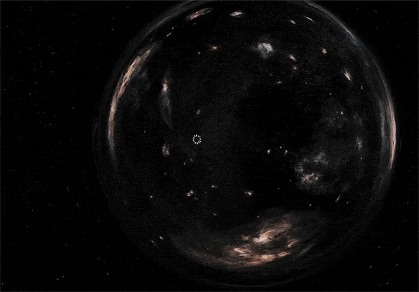

<section class="home-hero" aria-labelledby="home-title">
  

    <video class="home-gif home-motion" width="716" height="500" autoplay loop muted playsinline preload="metadata" poster="adds/adds_gif/Endurance-poster.webp" aria-hidden="true">
      <source src="adds/adds_gif/Endurance.webm" type="video/webm" media="(prefers-reduced-motion: no-preference)" />
      <source src="adds/adds_gif/Endurance.mp4" type="video/mp4" media="(prefers-reduced-motion: no-preference)" />
    </video>
    
  

  

    
Физика без лишнего шума

    <h1 id="home-title">Endurance</h1>
    
Системная теория по физике для подготовки к ОГЭ и ЕГЭ: без лишнего шума, с ясной логикой, аккуратными формулами и материалами, к которым удобно возвращаться перед экзаменом.

  

</section>

<section class="home-section" aria-labelledby="home-start-title">
  <h2 id="home-start-title">С чего начать</h2>
  
Откройте полный кодификатор тем или сразу перейдите к официальным материалам для подготовки.

  

    <a href="ОГЭ">Подготовка к ОГЭ</a>
    <a href="Теория-ЕГЭ-по-физике/">Подготовка к ЕГЭ</a>
    <a href="Материалы">Материалы ФИПИ</a>
  

</section>

<section class="home-section">
  <h2>Миссия проекта</h2>
  
Endurance помогает собрать школьную физику в цельную картину: от базовых определений до типовых экзаменационных сюжетов. Материалы написаны так, чтобы ученик видел не только готовую формулу, но и смысл, границы применимости и связь с задачами.

  <ul class="home-checklist">
    <li>Структурировать физическое знание для уверенной подготовки к государственным экзаменам.</li>
    <li>Объяснять темы простым языком, сохраняя точность и математическую аккуратность.</li>
    <li>Давать опору для самостоятельной тренировки к ОГЭ и ЕГЭ по физике.</li>
  </ul>
</section>

<section class="home-grid">
  

    <h2>Для кого</h2>
    
Сайт рассчитан на учеников 9-11 классов, которые готовятся к ОГЭ, ЕГЭ или хотят разобраться в физике глубже школьного минимума.

  

  

    <h2>Как пользоваться</h2>
    
Начинайте с нужного раздела теории или используйте поиск по сайту: он помогает быстро найти формулу, определение, закон или связанный разбор. В конце каждой статьи есть краткая сводка, а связанные темы доступны через внутренние ссылки и обратные связи.

  

</section>

<section class="home-contact">
  <h2>Связь и занятия</h2>
  
Если нашли неточность, хотите задать вопрос по материалам или обсудить подготовку, напишите мне удобным способом.

  

    <a href="https://t.me/karpuzivert">Telegram</a>
    <a href="https://vk.com/karpedze">VK</a>
    <a href="https://profi.ru/profile/KarpovDV15/">Профи.ру</a>
  

</section>
